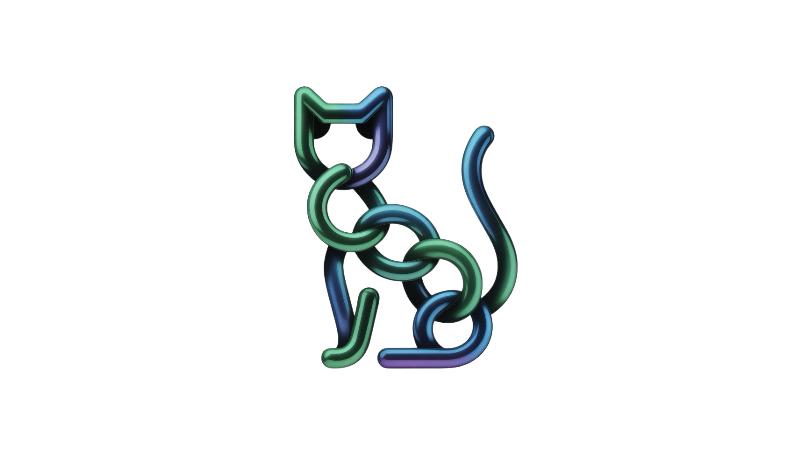

# QEDI - Privacy-First LinkTree on Sui

<div align="center">
  
  
  **The Web3 LinkTree with Enterprise-Grade Privacy & Security**
  
  [](https://sui.io)
  [](https://walrus.space)
  [](https://github.com/microsoft/SEAL)
  [](https://docs.sui.io/concepts/cryptography/zklogin)
</div>

---

## 🎯 Track: DATA SECURITY & PRIVACY

QEDI is a **production-ready, privacy-first LinkTree platform** built on Sui blockchain, designed specifically for the **DATA SECURITY & PRIVACY** track. We've implemented cutting-edge cryptographic technologies and privacy-preserving mechanisms throughout the entire stack.

### 🏆 Track Requirements - Fully Implemented

| Requirement | Status | Technology |
|------------|--------|------------|
| **Walrus** | ✅ | Verifiable storage for avatars with hash verification |
| **Seal SDK** | ✅ | Homomorphic encryption (BFV scheme) for bio data |
| **Fraud Detection** | ✅ | Real-time spam detection and fraud scoring system |
| **Zero-Knowledge Proofs** | ✅ | zkLogin authentication via Enoki (Google OAuth) |
| **Verifiable Storage** | ✅ | Walrus integration with SHA-256 hash verification |
| **Privacy Solutions** | ✅ | Granular privacy controls, GDPR compliance |
| **Sui Stack** | ✅ | Move smart contracts, Sui blockchain |

---

## 🔐 Privacy & Security Features

### 1. **Homomorphic Encryption (Seal SDK)**
- Bio data encrypted using Microsoft SEAL (BFV scheme)
- Zero-knowledge operations on encrypted data
- Backward compatible with AES-256-CBC
- Industry-leading cryptographic security

### 2. **Zero-Knowledge Authentication (zkLogin)**
- Sign in with Google - no wallet needed
- Privacy-preserving authentication
- No private key storage
- Sponsored transactions (zero gas fees)

### 3. **Verifiable Storage (Walrus)**
- All avatars stored on decentralized Walrus network
- SHA-256 hash verification on-chain
- Immutable, censorship-resistant storage
- Content-addressed blob storage

### 4. **Fraud Detection System**
- Real-time spam link detection
- Multi-factor fraud scoring (0-100 scale)
- URL validation and security checks
- Automatic review flagging

### 5. **Granular Privacy Controls**
- Private/public profiles
- Per-field visibility controls (bio, links)
- Anonymous viewing options
- Owner-only encrypted data access

### 6. **GDPR Compliance**
- Profile deletion endpoint
- Privacy settings update
- Data minimization principles
- Access control enforcement

---

## ✨ Key Features

### 🔐 Authentication & User Experience
- **zkLogin Integration**: Sign in with Google - no wallet setup required
- **Zero Gas Fees**: All transactions sponsored by backend via Enoki
- **Batch Operations**: Add 10 links in 1 transaction using PTB
- **Beautiful UI**: Animated DarkVeil background with WebGL effects
- **Mobile-First**: Fully responsive design optimized for all devices

### 🎨 Profile Management
- **Custom Profiles**: Username, display name, bio, avatar, theme
- **Encrypted Bio**: Optional Seal SDK encryption for sensitive data
- **Batch Link Addition**: Add multiple social/web links at once
- **On-Chain Storage**: Permanent, censorship-resistant data on Sui
- **Username Registry**: Human-readable profile URLs
- **Privacy Settings**: Granular control over data visibility

### 🚀 Technical Excellence
- **Walrus Sites Hosting**: Decentralized frontend deployment
- **Smart Contract**: Production-ready Move contract on Sui
- **Backend API**: Node.js backend with privacy services
- **Full TypeScript**: Type-safe codebase throughout
- **Seal SDK**: Homomorphic encryption for sensitive data

---

## 🏗 Architecture

```
QEDI/
├── frontend/                      # React + TypeScript + Vite
│   ├── src/
│   │   ├── components/           # UI components (DarkVeil, Galaxy, etc.)
│   │   ├── pages/                # Home, Create, EditProfile, MyProfiles, Profile
│   │   ├── lib/                  # Sui client, Enoki integration, constants
│   │   └── App.tsx               # Main app with navbar and routing
│   └── public/                   # Logo and static assets
├── backend/                       # Node.js + Express
│   └── src/
│       ├── server.ts             # Sponsored transaction endpoints
│       ├── privacy.ts            # Seal SDK encryption, privacy controls
│       ├── fraud-detection.ts    # Spam detection, fraud scoring
│       └── walrus-upload.ts      # Verifiable storage uploads
├── move/                          # Sui Move Smart Contracts
│   └── sources/
│       └── linktree.move         # Profile, Link, Registry structs
└── docs/                          # Documentation
    ├── ARCHITECTURE.md           # Detailed architecture (this track)
    ├── SETUP.md
    └── CURRENT_STATUS.md
```

**See [ARCHITECTURE.md](./ARCHITECTURE.md) for detailed technical documentation.**

---

## 🚀 Live Deployment

### Frontend - Walrus Sites
- **Status**: ✅ Live on Walrus testnet
- **URL**: `https://qedi.trwal.app`
- **Hosting**: Decentralized, censorship-resistant
- **Performance**: Global CDN via Walrus network
- **Privacy**: No server-side tracking, client-side only

### Backend - Privacy Services
- **Status**: ✅ Running on Render
- **URL**: `https://qedi.onrender.com`
- **Endpoints**: 
  - `/api/create-profile` - Sponsored profile creation
  - `/api/encrypt-bio` - Seal SDK encryption
  - `/api/check-fraud` - Fraud detection
  - `/api/upload-avatar` - Walrus upload with hash
  - `/api/delete-profile-data` - GDPR compliance
- **Gas Sponsorship**: Powered by Enoki SDK

### Smart Contract
- **Network**: Sui Testnet
- **Package ID**: `0x80290a4621d25a18c7d37cbc83dae3e85f05460ad13649b9f689100a2967e03a`
- **Registry ID**: `0x73ea10e7cfde7d60cfc5d712e4883f7845a7783a55c9be6183782cf971ae87de`
- **Status**: ✅ Deployed and verified

---

## 🛠 Technology Stack

### Blockchain & Infrastructure
- **Sui Blockchain** - High-performance L1 with Move language
- **Walrus Sites** - Decentralized hosting for frontend
- **Walrus Storage** - Verifiable storage for avatars
- **Enoki SDK** - zkLogin authentication + sponsored transactions
- **PTB (Programmable Transaction Blocks)** - Batch operations

### Privacy & Security
- **Seal SDK** - Homomorphic encryption (BFV scheme)
- **zkLogin** - Zero-knowledge authentication
- **SHA-256** - Hash verification for data integrity
- **Fraud Detection** - Real-time spam and fraud prevention

### Frontend
- **React 18** + **TypeScript** - Modern, type-safe development
- **Vite** - Lightning-fast build and HMR
- **TailwindCSS** - Utility-first styling
- **@mysten/dapp-kit** - Sui wallet integration
- **OGL (WebGL)** - DarkVeil animated backgrounds
- **React Router** - Client-side routing

### Backend
- **Node.js** + **Express** - Privacy services server
- **TypeScript** - Type-safe backend code
- **@mysten/sui** - Sui SDK for transaction building
- **Enoki** - Gas sponsorship via Enoki API
- **node-seal** - Microsoft SEAL for homomorphic encryption

---

## 🚀 Quick Start

### Prerequisites
- **Node.js** v18+ 
- **npm** or **yarn**
- **Enoki Account** (for zkLogin + sponsorship)
- **Google OAuth** credentials (for zkLogin)

### 1. Clone & Install

```bash
git clone <repository-url>
cd QEDI

# Install frontend dependencies
cd frontend
npm install

# Install backend dependencies
cd ../backend
npm install
```

### 2. Configure Environment

**Frontend** (`frontend/.env.local`):
```env
# Enoki API Keys
VITE_ENOKI_API_KEY=your_public_key
VITE_ENOKI_PRIVATE_KEY=your_private_key

# Google OAuth
VITE_GOOGLE_CLIENT_ID=your_google_client_id

# Smart Contract (already deployed)
VITE_PACKAGE_ID=0x80290a4621d25a18c7d37cbc83dae3e85f05460ad13649b9f689100a2967e03a
VITE_REGISTRY_ID=0x73ea10e7cfde7d60cfc5d712e4883f7845a7783a55c9be6183782cf971ae87de

# Backend URL
VITE_BACKEND_URL=http://localhost:3001
```

**Backend** (`backend/.env`):
```env
# Enoki Keys
ENOKI_API_KEY=your_private_key

# Smart Contract
PACKAGE_ID=0x80290a4621d25a18c7d37cbc83dae3e85f05460ad13649b9f689100a2967e03a

# Network
SUI_NETWORK=testnet
PORT=3001

# Privacy & Security
USE_SEAL=true              # Enable Seal SDK encryption
ENCRYPTION_KEY=your_key     # AES fallback key
```

### 3. Run Development Servers

**Terminal 1 - Backend**:
```bash
cd backend
npm run build
node dist/server.js
```

**Terminal 2 - Frontend**:
```bash
cd frontend
npm run dev
```

Open http://localhost:5173 🎉

---

## 💡 How It Works

### User Flow

1. **Sign In (Privacy-Preserving)**
   - Click "Sign In" → Choose Google
   - zkLogin creates Sui address from Google OAuth
   - No wallet installation needed
   - Zero-knowledge authentication

2. **Create Profile (Encrypted)**
   - Enter username, bio, avatar
   - Bio optionally encrypted with Seal SDK
   - Avatar uploaded to Walrus with hash verification
   - Click "Create Profile"
   - Backend sponsors transaction (user pays $0)
   - Profile stored on Sui blockchain

3. **Privacy Settings**
   - Set profile to private/public
   - Control bio and links visibility
   - Enable/disable anonymous viewing
   - Encrypted data accessible only to owner

4. **Add Links (Fraud-Protected)**
   - Real-time spam detection
   - URL validation and security checks
   - Fraud scoring for suspicious links
   - Batch addition via PTB (1 transaction)

5. **View & Share (Privacy-Aware)**
   - Profile accessible at custom URL
   - Privacy controls enforced
   - Verifiable avatar integrity
   - On-chain click tracking

---

## 🔒 Privacy & Security Deep Dive

### Encryption Architecture

**Seal SDK (Homomorphic Encryption):**
- BFV scheme for bio data encryption
- Zero-knowledge operations possible
- Backward compatible with AES-256-CBC
- Automatic format detection

**Verifiable Storage:**
- SHA-256 hash calculation
- Walrus decentralized storage
- On-chain hash verification
- Immutable blob storage

### Fraud Prevention

**Detection System:**
- Pattern matching (URL shorteners, spam domains)
- Keyword analysis (suspicious terms)
- Fraud scoring (0-100 scale)
- Automatic review flagging (threshold: 30)

**URL Validation:**
- Protocol validation (HTTP/HTTPS only)
- Hostname security checks
- Local/internal IP blocking
- Spam pattern detection

### Privacy Controls

**Granular Settings:**
- Profile visibility (private/public)
- Bio visibility toggle
- Links visibility toggle
- Anonymous viewing option

**Access Control:**
- Owner-only encrypted data access
- Viewer-based data filtering
- Privacy settings enforced on-chain
- GDPR-compliant data deletion

---

## 📱 Features Walkthrough

### Authentication
- **zkLogin (Google)**: One-click sign-in, no wallet needed
- **Regular Wallet**: Sui Wallet, Suiet, Ethos support
- Seamless switching between auth methods
- Privacy-preserving authentication

### Profile Creation
- Multi-step wizard (Basic Info → Links → Review)
- Username uniqueness check
- Avatar upload to Walrus (verifiable)
- Optional bio encryption (Seal SDK)
- Custom themes
- Real-time validation

### Privacy Settings
- Private/public profile toggle
- Bio visibility control
- Links visibility control
- Anonymous viewing option
- Encrypted data access (owner only)

### Batch Link Management
- Add multiple links before saving
- Real-time spam detection
- Fraud scoring
- Visual pending list with remove option
- "Save All" button creates single PTB transaction
- Works with both regular wallets AND zkLogin (sponsored)

### UI/UX
- **DarkVeil Background**: WebGL-powered animated gradient
- **Responsive Design**: Mobile-first, works on all devices
- **Custom Logo**: Unique cat chain logo throughout
- **Clean Navbar**: Centered navigation, minimal clutter
- **Toast Notifications**: Success/error feedback

---

## 📊 Project Stats

- **Lines of Code**: ~6,000+ (Move + TypeScript)
- **Smart Contract**: 447 lines of Move code
- **Frontend Components**: 8 React components + 6 pages
- **Backend Endpoints**: 6 privacy-focused APIs
- **Supported Auth**: zkLogin (Google) + Regular Wallets
- **Deployment**: Walrus Sites (decentralized)
- **Gas Fees**: $0 for all users
- **Encryption**: Seal SDK (homomorphic) + AES-256-CBC
- **Storage**: Walrus (verifiable, decentralized)

---

## 🎯 Innovation Highlights

### 1. Privacy-First Architecture
First LinkTree platform to combine:
- **Seal SDK** for homomorphic encryption
- **zkLogin** for zero-knowledge authentication
- **Walrus** for verifiable storage
- **Fraud Detection** for spam prevention
- **GDPR Compliance** for data protection

### 2. Enterprise-Grade Security
- Homomorphic encryption (industry-leading)
- Zero-knowledge proofs (zkLogin)
- Verifiable storage (hash verification)
- Real-time fraud detection
- Granular privacy controls

### 3. Web2 UX, Web3 Security
- Google sign-in (no wallet setup)
- Zero gas fees (sponsored transactions)
- Privacy-preserving authentication
- Encrypted sensitive data
- GDPR-compliant operations

### 4. Full-Stack Decentralization
- Frontend: Walrus Sites (decentralized storage)
- Storage: Walrus (verifiable blobs)
- Smart Contract: Sui blockchain (on-chain data)
- Backend: Privacy services (encryption, fraud detection)

---

## 🔧 Development

### Build for Production

**Frontend**:
```bash
cd frontend
npm run build
# Output: frontend/dist/
```

**Backend**:
```bash
cd backend
npm run build
# Output: backend/dist/
```

### Deploy to Walrus Sites

```bash
cd frontend

# Build first
npm run build

# Update routes in dist/ws-resources.json
# Then upload to Walrus
./site-builder update --epochs 1 ./dist <SITE_OBJECT_ID>
```

### Testing

```bash
# Frontend linting
cd frontend
npm run lint

# Backend linting
cd backend
npm run lint

# Move contract tests
cd move
sui move test
```

---

## 📈 Roadmap

### ✅ Completed (Phase 1 - Privacy & Security)
- [x] Seal SDK integration (homomorphic encryption)
- [x] zkLogin authentication (zero-knowledge)
- [x] Walrus verifiable storage (hash verification)
- [x] Fraud detection system (spam prevention)
- [x] Privacy controls (granular settings)
- [x] GDPR compliance (data deletion)
- [x] Smart contract with privacy features
- [x] Frontend deployed on Walrus Sites
- [x] Backend privacy services

### 🚧 In Progress (Phase 2)
- [ ] Mainnet deployment
- [ ] Enhanced fraud detection (ML-based)
- [ ] Multi-party computation for encrypted data
- [ ] Differential privacy for analytics

### 🔮 Future (Phase 3)
- [ ] Private link click tracking
- [ ] Encrypted profile sharing
- [ ] Zero-knowledge profile verification
- [ ] Privacy-preserving profile discovery
- [ ] Advanced homomorphic operations

---

## 🔒 Security & Privacy

### Encryption
- **Seal SDK**: Homomorphic encryption (BFV scheme)
- **AES-256-CBC**: Backward compatibility
- **SHA-256**: Hash verification for data integrity

### Authentication
- **zkLogin**: Zero-knowledge authentication
- **Enoki SDK**: Sponsored transactions
- **Google OAuth**: Privacy-preserving sign-in

### Storage
- **Walrus**: Decentralized, verifiable storage
- **On-Chain**: Immutable blockchain records
- **Hash Verification**: SHA-256 integrity checks

### Fraud Prevention
- **Real-Time Detection**: Spam link detection
- **Fraud Scoring**: Multi-factor analysis
- **URL Validation**: Security checks

### Privacy
- **Granular Controls**: Per-field visibility
- **Encrypted Data**: Seal SDK encryption
- **GDPR Compliance**: Data deletion
- **Access Control**: Viewer-based filtering

---

## 📝 License

MIT License - Open source and free to use

---

## 🙏 Acknowledgments

- **Sui Foundation** - For the amazing blockchain infrastructure
- **Mysten Labs** - For Sui SDK and tooling
- **Walrus Team** - For decentralized storage solution
- **Enoki** - For zkLogin and sponsorship capabilities
- **Microsoft SEAL** - For homomorphic encryption library

---

## 🚀 Quick Links

- **Live Demo**: [https://qedi.trwal.app](https://qedi.trwal.app)
- **Architecture**: [ARCHITECTURE.md](./ARCHITECTURE.md)
- **Smart Contract**: [View on Sui Explorer](https://suiexplorer.com/object/0x80290a4621d25a18c7d37cbc83dae3e85f05460ad13649b9f689100a2967e03a?network=testnet)
- **Documentation**: See `/docs` folder
- **Support**: Open an issue on GitHub

---

**QEDI** - Privacy by design, security by default. 🔒

*Built for the DATA SECURITY & PRIVACY track with enterprise-grade cryptographic technologies.*
